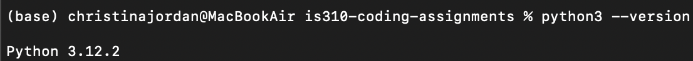
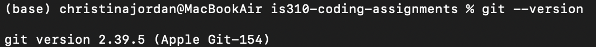
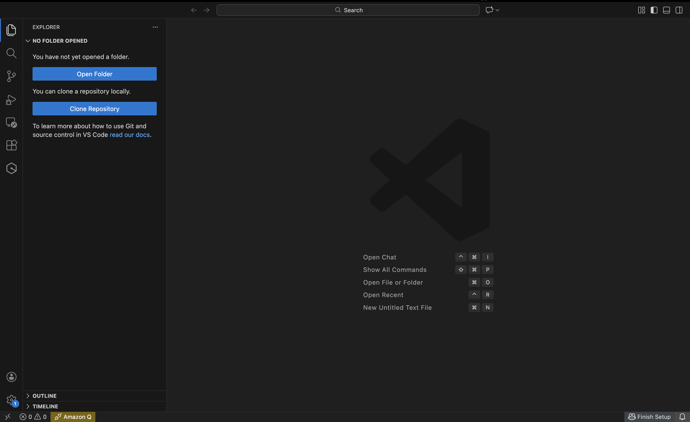
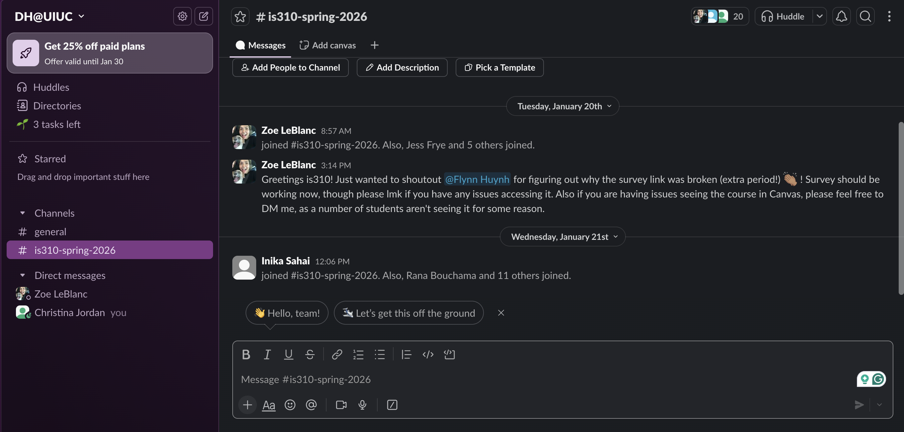
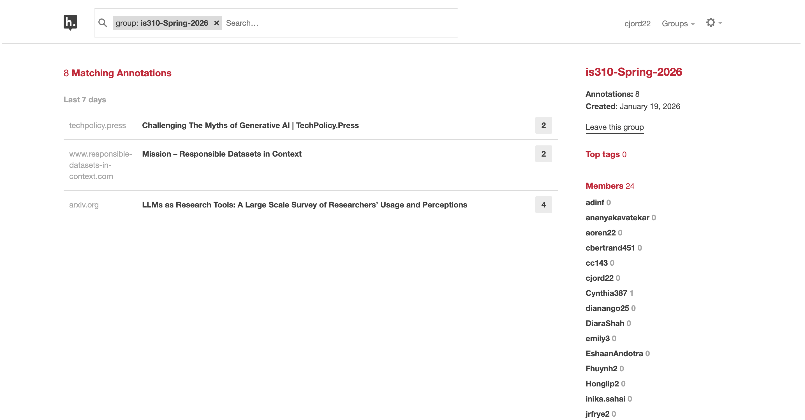
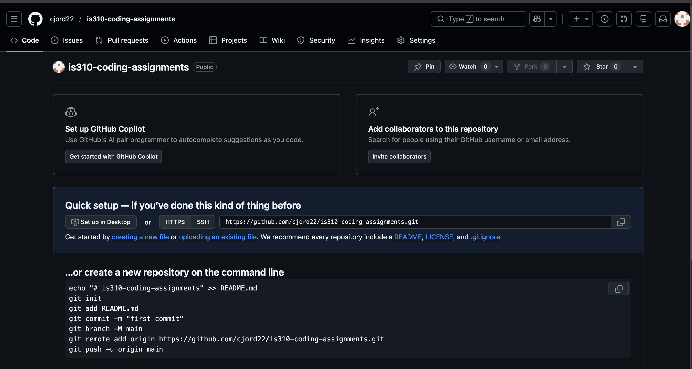

# Init IS310 Homework

## Proof of Installation

Hypothesis username: cjord22

1. Python  

2. Git  

3. VS Code  

4. Slack Account with DH@UIUC Server  

5. Hypothesis Account with IS310-Spring-2026 Group  

6. GitHub Account  

